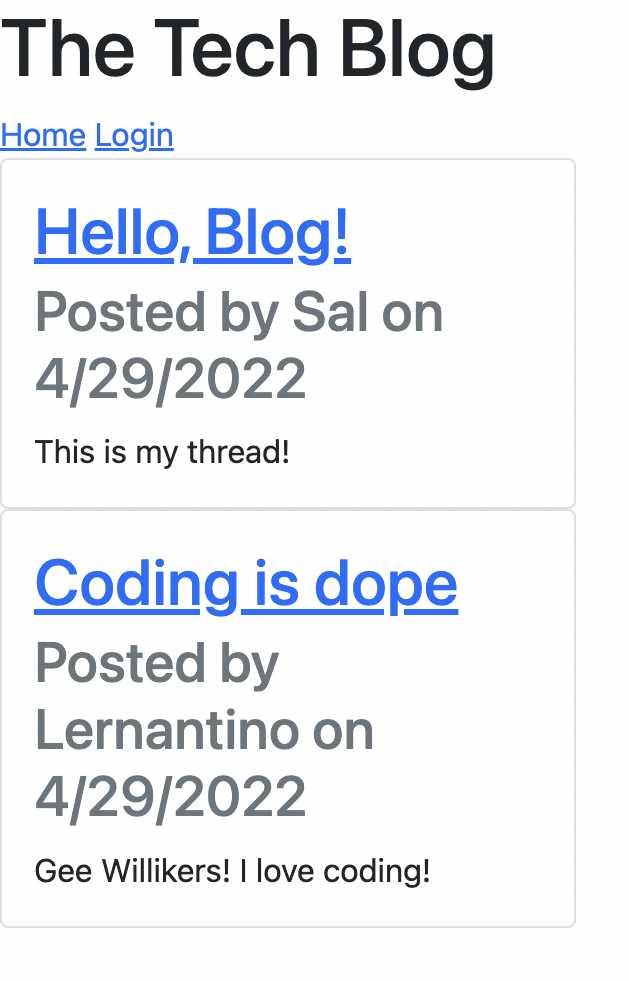

# Tech-Blog

[](https://opensource.org/licenses/MIT)

## Description

This is a full-stack web application built with Express, Sequelize, and Handlebars.js that allows users to create, edit, and comment on blog posts.



## Usage

You may host and use this application on your [local server](http://localhost:3001) after installing Node.js, adding your MySQL username and password to your .env, and running the following commands from the command line:

```
npm i
mysql -uroot -p
source db/schema
^c
npm run seed
npm start
```

Or you may visit the [deployed application](https://solar-powered-empathy.herokuapp.com/) hosted on Heroku.

### Questions

If you have any questions about this repository, open an issue or contact me directly at [pcragnol@gmail.com](mailto:pcragnol@gmail.com). You can find more of my work at [pcragnol](https://github.com/pcragnol/).

---
© 2022 Peter Cragnoline

Licensed under [MIT License](LICENSE)
